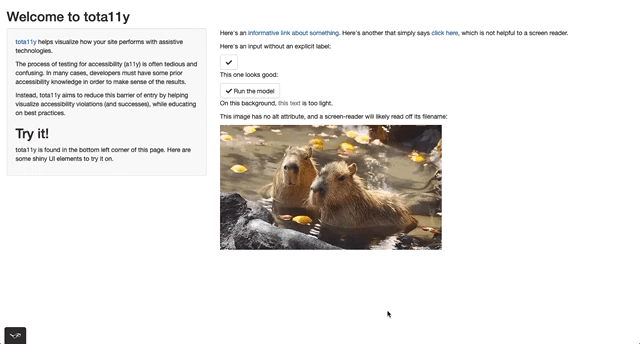

<!-- README.md is generated from README.Rmd. Please edit that file -->

# shinya11y

<!-- badges: start -->

[](https://www.tidyverse.org/lifecycle/#experimental)
[](https://CRAN.R-project.org/package=shinya11y)
[](https://github.com/ewenme/shinya11y/actions)
<!-- badges: end -->

Better accessibility (a11y) tooling for
[shiny](https://shiny.rstudio.com/).

## Installation

You can install the development version of shinya11y from
[GitHub](https://github.com/) with:

``` r
# install.packages("devtools")
devtools::install_github("ewenme/shinya11y")
```

## tota11y: an accessibility visualization toolkit

[tota11y](https://khan.github.io/tota11y) helps visualize how your shiny
app performs with assistive technologies.



Run the app above with `preview_tota11y()`.

Simply include `use_tota11y()` at the top of your shiny UI to test out
your app:

``` r
library(shiny)
library(shinya11y)

ui <- fluidPage(

  use_tota11y(),

  titlePanel("Welcome to tota11y"),

  sidebarLayout(
    sidebarPanel(
      tags$p(HTML("<a href='https://khan.github.io/tota11y'>tota11y</a> helps visualize how your site performs with assistive technologies.")),
      tags$p(span("The process of testing for accessibility (a11y) is often tedious and confusing. In many cases, developers must have some prior accessibility knowledge in order to make sense of the results.")),
      tags$p(span("Instead, tota11y aims to reduce this barrier of entry by helping visualize accessibility violations (and successes), while educating on best practices.")),
      tags$h2("Try it!"),
      tags$p(span("tota11y is found in the bottom left corner of this page. Here are some shiny UI elements to try it on."))
    ),
    mainPanel(
      tags$p(HTML("Here's an <a href='javascript:void 0'>informative link about something</a>. Here's another that simply says <a href='javascript:void 0'>click here</a>, which is not helpful to a screen reader.")),
      tags$p("Here's an input without an explicit label:"),
      actionButton("select", label = NULL, icon = icon("check")),
      tags$p("This one looks good:"),
      actionButton("select", label = "Run the model", icon = icon("check")),
      tags$p(HTML("On this background, <span style='color:#888'>this text</span> is too light.")),
      tags$p("This image has no alt attribute, and a screen-reader will likely read off its filename:"),
      img(src='capybara.gif')
    )
  )

)

server <- function(input, output, session) {

}

shinyApp(ui, server)
```
